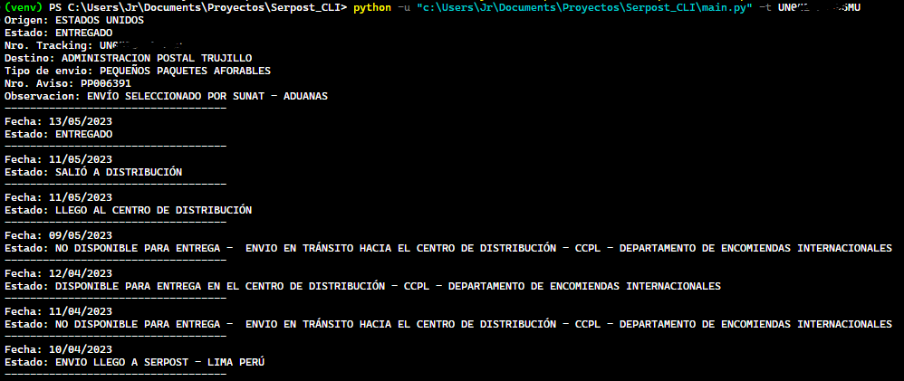

# Serpost CLI

Serpost CLI es una aplicación de línea de comandos que te permite consultar el estado de tus envíos de Serpost.

## Requisitos

- Python 3.x
- pip

## Instalación

1. Clona este repositorio en tu máquina local:

```
git clone https://github.com/Junior-HJ/Serpost_CLI
```

2. Ve al directorio del proyecto:

```
cd Serpost_CLI
```

3. Instala las dependencias requeridas:

```
pip install -r requirements.txt
```

## Uso

Para consultar el estado de un envío, ejecuta el script `main.py` seguido del número de seguimiento:

```
python main.py -t 8499449
```

Reemplaza `8499449` con el número de seguimiento real que deseas consultar.

> Captura de pantalla de la aplicación en ejecución.



**Dame una ⭐ si te gusta este proyecto😜!**

## Estructura del proyecto

El proyecto sigue una estructura de carpetas MVC (Modelo-Vista-Controlador) para mantener una separación clara de responsabilidades.

- `controllers`: Contiene los controladores de la aplicación.
- `models`: Contiene las clases que representan el modelo de datos y la lógica de negocios.
- `services`: Contiene las clases para interactuar con servicios externos.
- `parsers`: Contiene las clases para analizar los datos de los servicios externos.
- `views`: Contiene las clases relacionadas con la presentación de la aplicación.
- `main.py`: Archivo de entrada principal del script.

## Contribuciones

Las contribuciones son bienvenidas. Si deseas mejorar el proyecto, por favor, crea un *issue* para discutir las mejoras propuestas y luego realiza un *pull request* con tus cambios.

## Licencia © [Junior-HJ](https://www.linkedin.com/in/shilariojara/)

Este proyecto está bajo la Licencia Apache 2.0. Revisa el [LICENSE](LICENSE) para más detalles.
